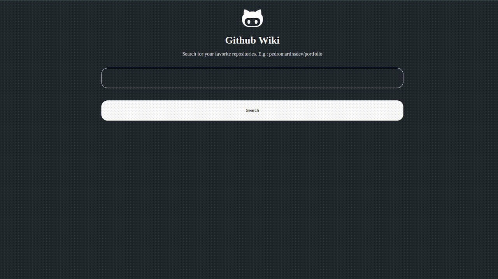

# Github Wiki

## :books: Projeto

Este projeto é uma wiki de repositórios do Github feito com React.

Os dados são consumidos da API do Github, [Github API](https://api.github.com/).

## :computer: Tecnologias

- React
- Styled components
- Axios

## :clap: Créditos
- Video Aulas: [DIO](https://www.dio.me/)
- API: [Github](https://api.github.com/)